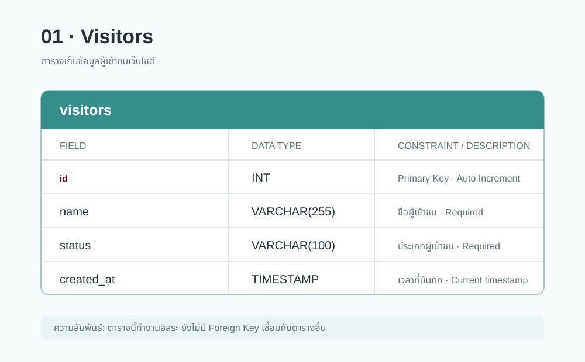
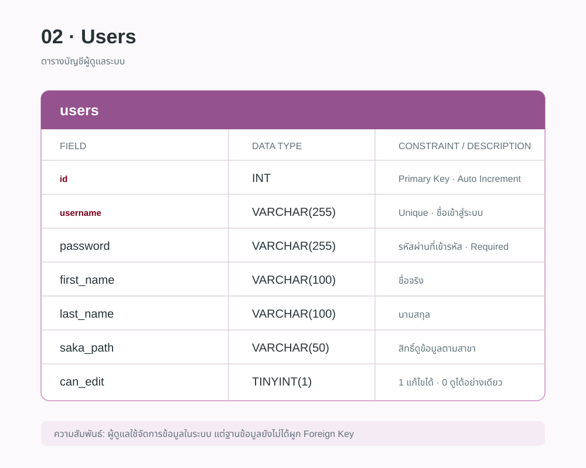
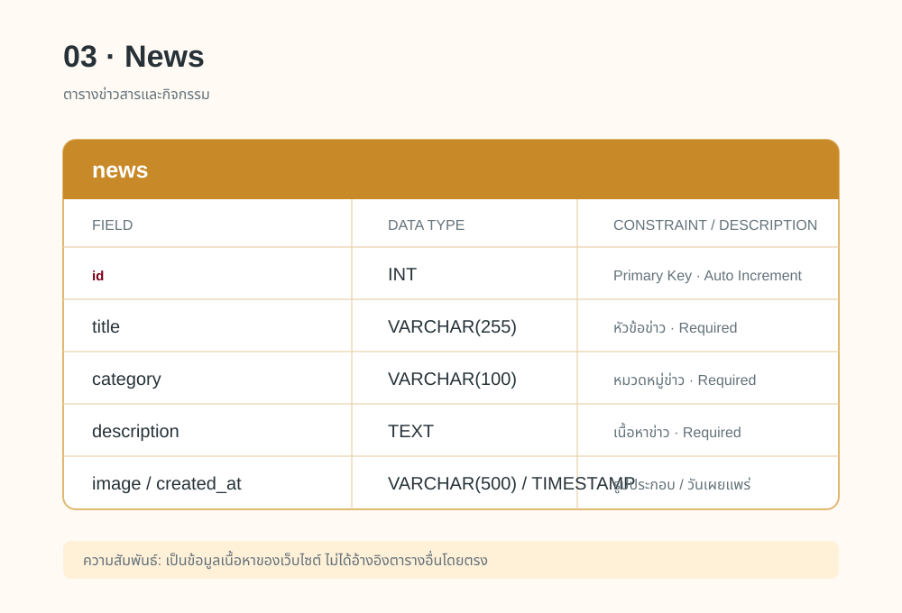
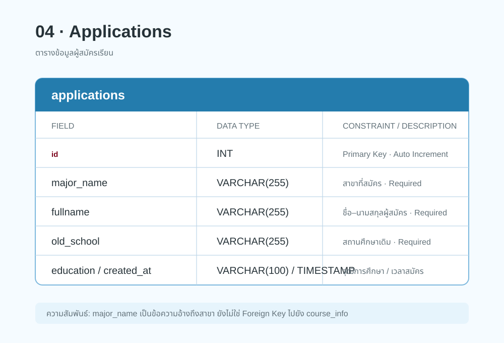
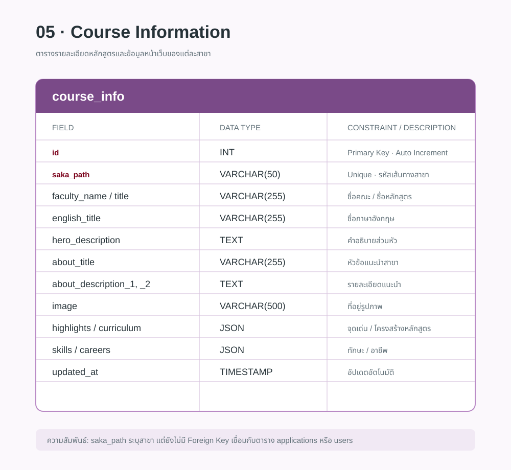

# โครงสร้างฐานข้อมูล `university_web`

## 1. ตารางผู้เข้าชมเว็บไซต์ — `visitors`

ตารางนี้ใช้เก็บข้อมูลผู้เข้าชมเว็บไซต์ ได้แก่ ชื่อผู้เข้าชม (`name`), ประเภทผู้เข้าชม (`status`) และวันเวลาที่บันทึกข้อมูล (`created_at`) โดย `id` เป็นรหัสประจำรายการที่ระบบสร้างให้อัตโนมัติ ตารางนี้นำไปใช้สรุปสถิติผู้เข้าเว็บไซต์ในหน้า Admin

## 2. ตารางผู้ดูแลระบบ — `users`

ตารางนี้ใช้เก็บบัญชีผู้ดูแลระบบ เช่น ชื่อผู้ใช้ (`username`), รหัสผ่าน (`password`), ชื่อ-นามสกุล และสาขาที่รับผิดชอบ (`saka_path`) ฟิลด์ `can_edit` กำหนดสิทธิ์การใช้งาน โดย `1` คือแก้ไขข้อมูลได้ และ `0` คือดูข้อมูลได้อย่างเดียว

## 3. ตารางข่าวสาร — `news`

ตารางนี้ใช้เก็บข่าวและกิจกรรมที่แสดงบนเว็บไซต์ ประกอบด้วยหัวข้อ (`title`), หมวดหมู่ (`category`), รายละเอียด (`description`), รูปภาพประกอบ (`image`) และวันเผยแพร่ (`created_at`)

## 4. ตารางผู้สมัครเรียน — `applications`

ตารางนี้ใช้เก็บข้อมูลจากแบบฟอร์มสมัครเรียน ได้แก่ สาขาที่สมัคร (`major_name`), ชื่อผู้สมัคร (`fullname`), โรงเรียนเดิม (`old_school`), วุฒิการศึกษา (`education`) และวันเวลาที่ส่งใบสมัคร (`created_at`)

## 5. ตารางรายละเอียดหลักสูตร — `course_info`

ตารางนี้ใช้เก็บรายละเอียดของแต่ละสาขา เช่น ชื่อหลักสูตร คำอธิบาย รูปภาพ จุดเด่น โครงสร้างหลักสูตร ทักษะ และอาชีพ โดยข้อมูลที่มีหลายรายการ เช่น `highlights`, `curriculum`, `skills` และ `careers` จะเก็บในรูปแบบ JSON เพื่อให้ยืดหยุ่นต่อการแสดงผลหน้าเว็บไซต์

> หมายเหตุ: ฐานข้อมูลปัจจุบันยังไม่มี Foreign Key เชื่อมระหว่างตารางโดยตรง
